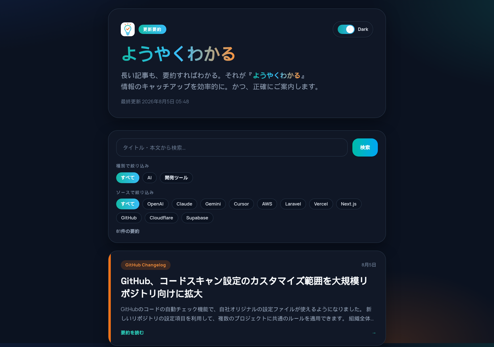
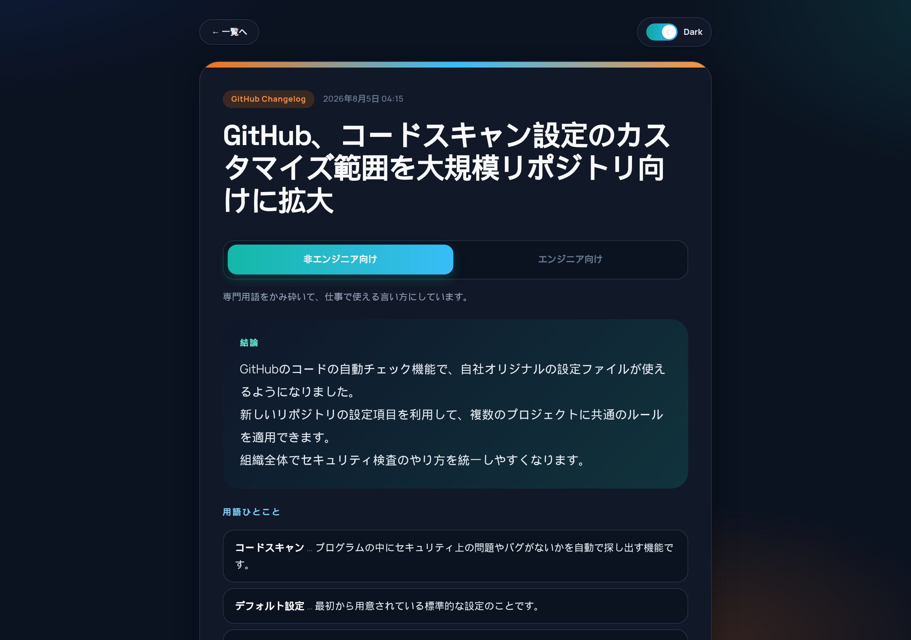

# ようやくわかる

公式アプデは正しい。でも長くて、読む気にならない——それでも正確さは欲しい人向けに、RSS で集めた公式更新を日本語の「結論＋使える場面」だけで読める更新リーダーです。

**Demo:** https://yoyaku-wakaru.vercel.app





ChatGPT / Claude / Gemini などの更新を追いながら、「何が変わったか」「自分の仕事にどう効くか」だけ先に把握できます。

## 主な機能

- 公式・準公式 RSS から新着を自動取り込み
- X の投稿は API では取らない。人が渡した候補だけを仕分けし、公式URLがあるものだけ記事にする
- 一覧の初期表示は直近24時間。同じソースの近い更新はまとめて出す
- Gemini による日本語要約（結論 / 用語ひとこと / 使える場面）
- **非エンジニア向け / エンジニア向け** の2ボイス切替（事実は同じ・言い方だけ変える）
- **30秒で読む / 詳しく読む** の粒度切替（結論だけ先に読める）
- ジャンル絞り込み・キーワード検索・ページネーション
- **あとで読む・既読・未読のみ表示**（ログイン不要。この端末のブラウザにのみ保存）
- **ウォッチキーワード**（登録した語を含む記事に印を付けて絞り込み）
- 保存データの管理ページ `/library`（JSON エクスポート / インポート / 全削除）
- 要約の **Markdown / Slack 用コピー** と、詳細ページの**関連ニュース**表示
- 任意で Slack 通知

> 保存・既読・ウォッチは localStorage（端末内だけに保存する領域）を使うため、認証・追加インフラなしで動きます。端末間の同期はありません。

## 構成

| 役割 | 技術 |
|---|---|
| 画面・取り込み API | Next.js（Vercel） |
| RSS 取得 → 要約 → 送信 | Google Apps Script + Gemini |
| 記事の保存（任意） | Neon（Postgres）。未設定時はローカル JSON / サンプル表示 |

## 要約フォーマット

詳細ページでは読者タブと、要約の深さ（30秒で読む / 詳しく読む）を切り替えます。各ボイス共通で次の構成です。

1. **結論**（3行程度）… どちらの深さでも表示
2. **詳細内容**（2〜4文）… 「詳しく読む」のみ。背景・変更点・注意点の補足
3. **使えるシチュエーション**（3点）… 「詳しく読む」のみ
4. **用語ひとこと**（必要な語だけ、一口解説）… 「詳しく読む」のみ

既存記事に詳細内容が無い場合は、そのセクションだけ非表示になります。GAS の `backfillDualVoiceArticles` で再要約すると埋まります。

## セットアップ

### 1. 必要なキー

| 名前 | どこに置くか | 用途 |
|---|---|---|
| `GOOGLE_API_KEY` | GAS スクリプトプロパティ | Gemini 要約 |
| `INGEST_SECRET` | Vercel 環境変数 と GAS（同じ値） | `/api/ingest` の認証 |
| `DATABASE_URL` | Vercel 環境変数（推奨） | 本番の永続化（Neon） |
| `SLACK_WEBHOOK_URL` | GAS（任意） | 新着の Slack 通知 |

画面を見るだけなら、キーなしでローカル起動できます（サンプル表示）。

### 2. ローカルで画面を見る

```bash
npm install
cp .env.example .env.local
# 画面閲覧だけなら空のままでOK
# 取り込みや本番DB接続をするなら INGEST_SECRET / DATABASE_URL を埋める
npm run dev
```

開く: http://localhost:3000

### 3. Vercel へデプロイ

ワンクリック Import（Vercel / GitHub にログイン済みの状態で開く）:

https://vercel.com/new/import?s=https://github.com/osanai1004/ai-feed-digest

1. Framework Preset: Next.js（自動検出）
2. Environment Variables:
   - `INGEST_SECRET` = 長いランダム文字列
3. Deploy
4. （推奨）Marketplace で Neon Free を接続して `DATABASE_URL` を入れる

CLI 例:

```bash
npx vercel link --yes
npx vercel env add INGEST_SECRET production
npx vercel --prod --yes
```

### 4. GAS 連携

詳細は [`gas/README.md`](./gas/README.md)。

1. [Apps Script](https://script.google.com/) で新規プロジェクト
2. `gas/Code.gs` を貼り付け
3. スクリプトプロパティを設定:
   - `GOOGLE_API_KEY` = Gemini API キー
   - `INGEST_URL` = `https://<your-app>.vercel.app/api/ingest`
   - `INGEST_SECRET` = Vercel と同じ値
   - `SLACK_WEBHOOK_URL` = （任意）Slack Incoming Webhook
   - `APP_BASE_URL` = （任意）アプリのベース URL
4. `runOnce` を手動実行（初回は権限承認）… 新着のみ取り込み
5. 既存記事を2ボイス化したいときは `backfillDualVoiceArticles`（必要なら複数回）
6. 毎日自動なら `createDailyTrigger` を実行

監視対象（初期設定）: OpenAI / Claude / Claude Code / Anthropic News / Google DeepMind / Google AI / Gemini / Cursor / Laravel / Vercel / Next.js / GitHub Changelog / Cloudflare / Supabase / AWS（Machine Learning）

Slack 通知は Webhook 未設定ならスキップされます（後から有効化可）。

## API

### `POST /api/ingest`

```http
Authorization: Bearer <INGEST_SECRET>
Content-Type: application/json
```

```json
{
  "source": "OpenAI",
  "title": "記事タイトル",
  "url": "https://example.com/post",
  "publishedAt": "2026-08-02T00:00:00.000Z",
  "summary": {
    "general": {
      "conclusion": "非エンジニア向け結論1行目\\n2行目\\n3行目",
      "detail": "詳細の補足1\\n詳細の補足2\\n詳細の補足3",
      "situations": ["場面1", "場面2", "場面3"],
      "terms": [{ "term": "API", "plain": "アプリ同士の接続口" }]
    },
    "engineer": {
      "conclusion": "エンジニア向け結論1行目\\n2行目\\n3行目",
      "detail": "詳細の補足1\\n詳細の補足2\\n詳細の補足3",
      "situations": ["場面1", "場面2", "場面3"],
      "terms": [{ "term": "API", "plain": "外部から機能を呼ぶインターフェース" }]
    }
  }
}
```

旧形式（`summary.conclusion` + `summary.situations`）も受け付け、両ボイスへ展開します。

X 由来で公式URLがある記事は、同じエンドポイントに次を足します。`url` は公式ページ、`xPostUrl` は投稿です。`signalId` は必須で、`ready` の候補だけを `ingested` にします。

```json
{
  "origin": "x",
  "xPostUrl": "https://x.com/someone/status/123",
  "officialNote": "公式もこう言っている",
  "signalId": "s_0123456789abcdef"
}
```

`origin` を付けない既存の RSS 取り込みはそのまま動きます。同じ公式URLが既にあれば1件にまとまり、後から付いた X のリンクは RSS の再取り込みでは消えません。

### `POST /api/intake`

浅子がブラウザで拾った X の候補を渡す入口です。X の API は使いません。`Authorization: Bearer <INGEST_SECRET>` が必要です。

```json
{
  "items": [
    {
      "xPostUrl": "https://x.com/someone/status/123",
      "text": "Claude の新しいモデルが公開された、という投稿本文",
      "source": "Claude",
      "author": "@someone",
      "publishedAt": "2026-10-01T00:00:00.000Z"
    }
  ]
}
```

1件だけなら `items` なしで同じフィールドを直に渡せます。サーバーが粗い仕分けをします。

| 結果 | 意味 |
|---|---|
| `pending_review` | 浅子の確認待ち |
| `filtered` | 短すぎる、または監視製品名が無い。`restore` で確認待ちに戻せる |
| 同じ URL の再送 | 確認待ち以降のものは上書きしない（`duplicate: true`） |

### `GET /api/intake`

同じ秘密文字列が必要です。`status` を省略すると作業列（`pending_review` / `needs_factcheck` / `ready`）です。`memo` や `filtered`、`all` も指定できます。

### `POST /api/intake/:id`

浅子と龍馬の判断です。`actor` は記録用です（認証の分けはまだありません）。

| action | 誰 | 結果 |
|---|---|---|
| `approve` + `officialUrl` | 浅子 | `ready`。この後 GAS の `ingestReadyXSignals` が2ボイス要約して記事にする |
| `approve`（URLなし） | 浅子 | `memo`。記事にはしない |
| `flag_factcheck` | 浅子 | `needs_factcheck`。裏取りが曖昧なとき龍馬へ |
| `resolve_factcheck` + `officialUrl` | 龍馬 | `ready` |
| `resolve_factcheck`（URLなし） | 龍馬 | `memo` |
| `reject` | どちらでも | `rejected` |
| `restore` | 浅子 | `filtered` を確認待ちに戻す |

公式URLがある X 記事は1件です。画面には X の投稿リンクと「公式もこう言っている」を出します。メモは `/memos` に出します。

### `GET /api/articles`

保存済み記事一覧。

## UI

[VoltAgent/awesome-design-md](https://github.com/VoltAgent/awesome-design-md) の Clay / Framer 系を参考にしたカード UI です。

- ソフトなグラデーション背景
- 角丸カード + ホバーで浮く
- ソース別カラーバッジ
- Space Grotesk（見出し）+ Manrope（本文）

## iPhone での見方

1. Safari で Demo URL（または自分の Vercel URL）を開く
2. 共有 → **ホーム画面に追加**
3. 一覧タップ → 要約確認 → 必要なら「元記事で詳細を確認する」

## License

[MIT](./LICENSE)
